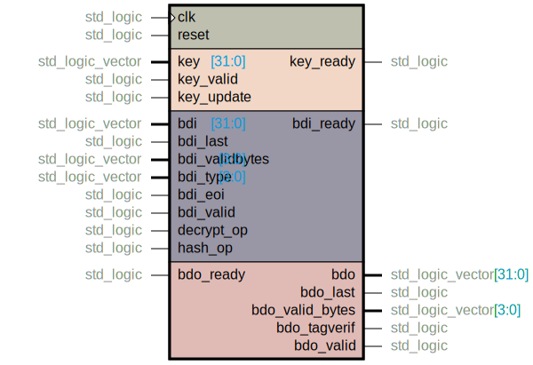
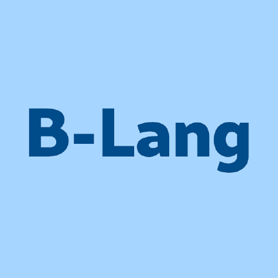

# Hardware implementation of Sparkle Lightweight Cipher
This repository includes multiple hardware implementations of [Sparkle](https://sparkle-lwc.github.io) Lightweight cipher

Sparkle is one of the ten finalist in [NIST Lightweight Cryptography (LWC)  standardization process](https://csrc.nist.gov/Projects/lightweight-cryptography/).

## Primitives
### Alzette
Alzette is a 64-bit S-box based on Add-Rotate-XOR (ARX) paradigm.

In this diagram, the transformed block `b` is split into two halves: `x := b[31..0]` and `y := b[63..32]`.

### Sparkle
Sparkle is a family of cryptographic permutations relying on using the ARX S-box.

Schwaemm is an AEAD algorithm that uses the Sparkle permutations

## Implementation

- VHDL
    - [sparkle](vhdl/sparkle.vhdl):
        

- Bluespec SystemVerilog (B-Lang)

