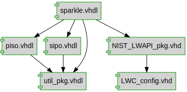

# Documentation for: 

## Designs

- Module: [LWC ](./doc_internal/LWC.md)
- Package: [NIST_LWAPI_pkg ](./doc_internal/NIST_LWAPI_pkg.md)
- Module: [PostProcessor ](./doc_internal/PostProcessor.md)
- Module: [PreProcessor ](./doc_internal/PreProcessor.md)
- Module: [DATA_PISO ](./doc_internal/data_piso.md)
- Module: [DATA_SIPO ](./doc_internal/data_sipo.md)
- Module: [FIFO ](./doc_internal/fifo.md)
- Module: [KEY_PISO ](./doc_internal/key_piso.md)
- Package: [LWC_config ](./doc_internal/LWC_config.md)
- Package: [alzette_defs ](./doc_internal/alzette.md)
- Module: [cryptocore ](./doc_internal/cryptocore.md)
- Package: [design_pkg ](./doc_internal/design_pkg.md)
- Module: [PISO ](./doc_internal/piso.md)
- Module: [SIPO ](./doc_internal/sipo.md)
- Module: [sparkle ](./doc_internal/sparkle.md)
- Package: [util_pkg ](./doc_internal/util_pkg.md)

