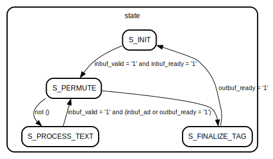

# Entity: sparkle 

- **File**: sparkle.vhdl
## Diagram

## Generics

| Generic name     | Type     | Value | Description                                             |
| ---------------- | -------- | ----- | ------------------------------------------------------- |
| IO_WIDTH         | positive | 32    | Width of I/O data in bits. TODO: only 32 supported ATM! |
| SPARKLE_RATE     | positive | 256   | Rate in bits                                            |
| SPARKLE_CAPACITY | positive | 128   | Capacity in bits                                        |
## Ports

| Port name            | Direction | Type                                        | Description |
| -------------------- | --------- | ------------------------------------------- | ----------- |
| clk                  | in        | std_logic                                   |             |
| reset                | in        | std_logic                                   |             |
| key                  | in        | std_logic_vector(IO_WIDTH - 1 downto 0)     |             |
| key_valid            | in        | std_logic                                   |             |
| key_ready            | out       | std_logic                                   |             |
| key_update           | in        | std_logic                                   |             |
| bdi                  | in        | std_logic_vector(IO_WIDTH - 1 downto 0)     |             |
| bdi_last             | in        | std_logic                                   |             |
| bdi_validbytes       | in        | std_logic_vector(IO_WIDTH / 8 - 1 downto 0) |             |
| bdi_type             | in        | std_logic_vector(3 downto 0)                |             |
| bdi_eoi              | in        | std_logic                                   |             |
| bdi_valid            | in        | std_logic                                   |             |
| bdi_ready            | out       | std_logic                                   |             |
| decrypt_op           | in        | std_logic                                   |             |
| hash_op              | in        | std_logic                                   |             |
| bdo_bits_word        | out       | std_logic_vector(IO_WIDTH - 1 downto 0)     |             |
| bdo_bits_last        | out       | std_logic                                   |             |
| bdo_bits_valid_bytes | out       | std_logic_vector(IO_WIDTH / 8 - 1 downto 0) |             |
| bdo_bits_tag         | out       | std_logic                                   |             |
| bdo_valid            | out       | std_logic                                   |             |
| bdo_ready            | in        | std_logic                                   |             |
## Signals

| Name               | Type                                          | Description |
| ------------------ | --------------------------------------------- | ----------- |
| sparkle_state      | t_sparkle_state                               |             |
| inbuf_validbytes   | t_rate_bytevalid                              |             |
| step_counter       | t_step_counter                                |             |
| state              | t_fsm                                         | FSM state   |
| inbuf_ct           | boolean                                       |             |
| inbuf_hm           | boolean                                       |             |
| inbuf_ad           | boolean                                       |             |
| inbuf_eoi          | boolean                                       |             |
| outbuf_tag         | boolean                                       |             |
| outbuf_tagverif    | boolean                                       |             |
| perm_slim_steps    | boolean                                       |             |
| final              | boolean                                       |             |
| keybuf_slva        | t_slv_array(0 to KEY_WORDS - 1)(31 downto 0)  |             |
| inbuf_slva         | t_slv_array(0 to RATE_WORDS - 1)(31 downto 0) |             |
| outbuf_slva        | t_slv_array(0 to RATE_WORDS - 1)(31 downto 0) |             |
| input_word         | std_logic_vector(IO_WIDTH - 1 downto 0)       |             |
| output_word        | std_logic_vector(IO_WIDTH - 1 downto 0)       |             |
| output_validbytes  | std_logic_vector(IO_WIDTH / 8 - 1 downto 0)   |             |
| keybuf             | t_key_buffer                                  |             |
| inbuf              | t_rate_buffer                                 |             |
| outbuf             | t_rate_buffer                                 |             |
| rho_whitened_state | t_sparkle_state                               |             |
| inbuf_valid        | std_logic                                     |             |
| inbuf_ready        | std_logic                                     |             |
| inbuf_valid_words  | t_bit_array(0 to RATE_WORDS - 1)              |             |
| outbuf_valid_words | t_bit_array(0 to RATE_WORDS - 1)              |             |
| keybuf_valid       | std_logic                                     |             |
| keybuf_ready       | std_logic                                     |             |
| outbuf_valid       | std_logic                                     |             |
| outbuf_ready       | std_logic                                     |             |
| inbuf_last         | std_logic                                     |             |
| inbuf_incomp       | std_logic                                     |             |
| outbuf_last        | std_logic                                     |             |
| last_permute       | boolean                                       |             |
## Constants

| Name               | Type     | Value                                                                                                                                                                                                                                                                                                                                                                            | Description                   |
| ------------------ | -------- | -------------------------------------------------------------------------------------------------------------------------------------------------------------------------------------------------------------------------------------------------------------------------------------------------------------------------------------------------------------------------------- | ----------------------------- |
| TAG_WORDS          | positive | 4                                                                                                                                                                                                                                                                                                                                                                                |                               |
| KEY_WORDS          | positive | 128 / 32                                                                                                                                                                                                                                                                                                                                                                         |                               |
| STATE_BITS         | positive | SPARKLE_RATE + SPARKLE_CAPACITY                                                                                                                                                                                                                                                                                                                                                  |                               |
| STATE_BRANS        | positive | STATE_BITS / 64                                                                                                                                                                                                                                                                                                                                                                  |                               |
| STATE_WORDS        | positive | STATE_BITS / 32                                                                                                                                                                                                                                                                                                                                                                  |                               |
| RATE_WORDS         | positive | SPARKLE_RATE / 32                                                                                                                                                                                                                                                                                                                                                                |                               |
| CAP_WORDS          | positive | SPARKLE_CAPACITY / 32                                                                                                                                                                                                                                                                                                                                                            |                               |
| SPARKLE_STEPS_BIG  | positive | 11                                                                                                                                                                                                                                                                                                                                                                               | 10, 11, 12                    |
| SPARKLE_STEPS_SLIM | positive | 7                                                                                                                                                                                                                                                                                                                                                                                | 8 for Sparkle512, otherwise 7 |
| ROUND_CONSTANTS    | t_rcon   | (     X"B7E15162",  X"BF715880",  X"38B4DA56",  X"324E7738",      X"BB1185EB",  X"4F7C7B57",  X"CFBFA1C8",  X"C2B3293D"   ) |                               |
## Types

| Name   | Type                                                                                                                                                            | Description          |
| ------ | --------------------------------------------------------------------------------------------------------------------------------------------------------------- | -------------------- |
| t_fsm  | (S_INIT,  S_PERMUTE,  S_PROCESS_TEXT,  S_FINALIZE_TAG) | Finite state machine |
| t_rcon |                                                                                                                                                                 |                      |
## Functions
- arxbox1 (r1,  r2 : in natural range 0 to 31;  c : in t_uint32;  x,  y : inout t_uint32)  return ()
- alzette (c : in t_uint32;  x,  y : inout t_uint32)  return ()
- ell (x : t_uint32)  return t_uint32 
- linear_layer (state : inout t_sparkle_state)  return ()
- sparkle_step (state : t_sparkle_state;  step : t_step_counter)  return t_sparkle_state 
- inbuf_word (w,  xw : t_uint32;  valid_bytes : std_logic_vector(3 downto 0);  ct : boolean)  return t_uint32 
- padword (word        : std_logic_vector(IO_WIDTH - 1 downto 0);  valid_bytes : std_logic_vector(IO_WIDTH/8 - 1 downto 0);  pad_0x80    : BOOLEAN )  return std_logic_vector 
- rho_whi (ct              : in boolean;  ad              : in boolean;  last_block      : in boolean;  incomplete      : in boolean;  inbuf           : in t_rate_buffer;  inbuf_bytevalid : in t_rate_bytevalid;  instate         : in t_sparkle_state;  outbuf          : out t_rate_buffer;  outstate        : out t_sparkle_state)  return ()
## Processes
- COMB_PROC: ( all )
- FLAG_REG_PROC: ( clk )
- REG_PROC: ( clk )
## Instantiations

- INBUF_SIPO: work.SIPO
- KEY_SIPO: work.SIPO
- OUTBUF_PISO: work.PISO
## State machines

